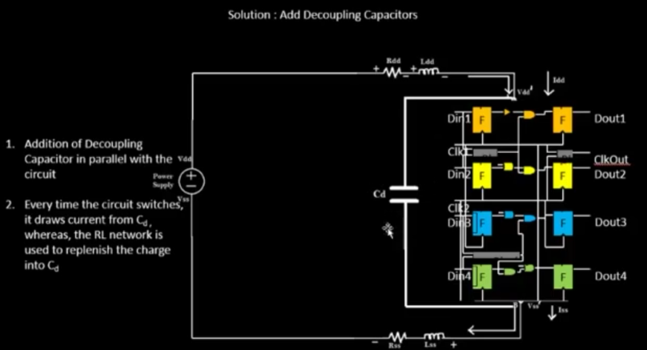
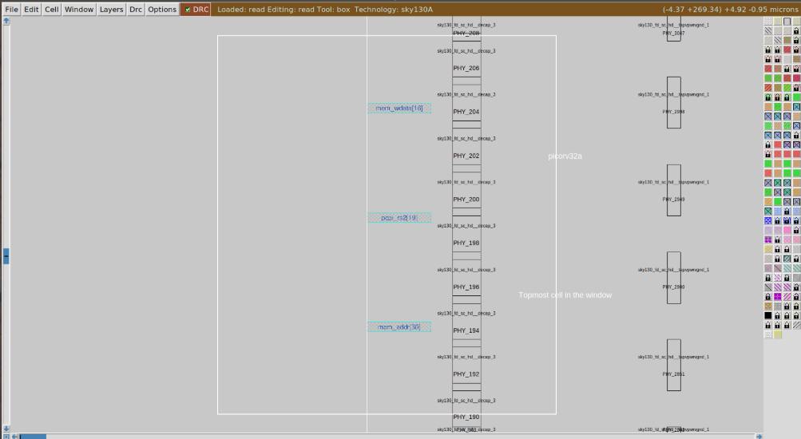
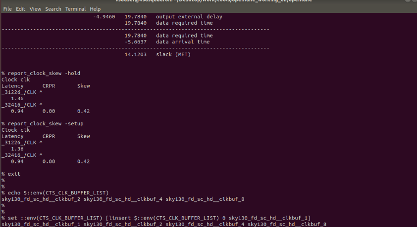

Digital VLSI SoC Design and Planning 

## DAY 1
### Introduction to QFN-48 Package, chip, pads, core, die and IPs

An integrated circuit, also known as a microchip, chip or IC, is a small electronic device made up of multiple interconnected electronic components such as transistors, resistors, and capacitors. These components are etched onto a small piece of semiconductor material, usually silicon. Chip is usually present at the center of a package wherein, the connections from package is fed to the chip by WIRE BOUND method which is none other than basic wired connection


The diagram below illustrates a block-level architecture of a Processor or System on Chip (SoC) along with its interfacing components. It highlights the pinout layout and shows how various peripherals connect to the SoC. This is a typical example of an SoC interface, commonly used in embedded system design. It shows how communication interfaces like I2C, UART as well as memory units. It also includes power and ground connections.In technical term the processor with all components is called a PACKAGE. One kind of package, which is used in the arduino board is a QFN - 48 package (Quad Flat No-Leads).


A chip is actually inside a package, and is connected to various "PINS" or inputs/outputs.
components of chip are:
1. pads : Pads serve as the connection points between the integrated circuit and the external chip package. These small structures are responsible for transmitting electrical signals into and out of the chip. They are carefully designed and positioned to align with the package pins.
2. core : The core is where the digital logic resides. It includes all the fundamental building blocks like AND, OR, XOR gates, multiplexers (MUXes), and more. This is the heart of the chip—responsible for executing all processor functions.
3. die : A die is a single piece cut from a larger semiconductor wafer. It can function independently and often contains one or more cores. Each die represents a complete, functional unit ready to be packaged or integrated into devices.


Inside the core, there are two main types of reusable components:

Foundry IPs are building blocks provided by the chip manufacturer (foundry). These are already designed and tested. They include things like PLLs (for clock control), ADCs (for signal conversion), and SRAM (for memory).

Macros are similar to Foundry IPs but are purely digital. These are standard logic blocks that can be reused across different chip designs. Common examples include GPIO banks and SPI controllers.

Together, these components help in designing an efficient, reliable, and reusable SoC.

### Introduction to RISC-V
---
RISC-V is an open-standard Instruction Set Architecture (ISA) based on the principles of Reduced Instruction Set Computing (RISC).A C program which has to be run on a specific hardware layout which is the interior of a chip in your laptop, there is certain flow to be followed. Initially, this particular C program is compiled in it's assembly language program which is nothing but RISC-V ISA (Reduced Instruction Set Compting - V Intruction Set Architecture).Following this, the assembly language program is then converted to machine language program which is the binary language logic 0 and 1 which is understood by the hardware of the computer.Directly after this, we've to implement this RISC-V specification using some RTL (a Hardware Description Language). Finally, from the RTL to Layout it is a standard PnR or RTL to GDSII flow. 

Unlike proprietary ISAs like ARM or x86, RISC-V is free to use, allowing individuals, companies, and universities to design and build their own processors without licensing fees. In hardware, the chip is connected to its package using bond wires.


### From Software Applications to Hardware
---
Devices are powered by chips, but apps written in high-level languages can't run directly on hardware. They must be translated into binary machine code that the chip understands. This is where system software comes into play.

System software handles the translation process in the following steps:

1. Operating Systems (OS): The OS manages hardware resources and performs essential tasks like input/output operations, memory management, and low-level system functions. It also interacts with the application software and sends code to the compiler for translation.
2. Compilers: Compilers take the high-level source code (e.g., C/C++) and convert it into lower-level machine instructions suited for the hardware. These instructions are architecture-specific and are often referred to as ISAs (Instruction Set Architectures). The output is usually an executable file (e.g., .exe) that is passed to the assembler.
3. Assemblers: Assemblers translate the compiler-generated instructions into binary machine code. This binary code is what the hardware finally executes.
  


In the image above shows Stopwatch App as an example. A C program is written to implement the stopwatch functionality. Here's how it's executed step by step:
1. The program is compiled by the system (e.g., Windows/Linux) into machine instructions.
2. These instructions are then translated into RISC-V assembly code.
3. The RISC-V code is converted by the assembler into binary format.
4. This binary is processed by the RTL (Register Transfer Level) design of the hardware.
5. RTL is synthesized into a netlist, which describes the circuit connections.
6. Finally, the netlist is turned into a chip layout during physical design, producing real, functioning hardware capable of running the stopwatch.

There are mainly 3 different parts in this course. They are:
* RISC-V ISA
* RTL and synthesis of RISC-V based CPU core - picorv32
* Physical design implementation of picorv32


### SoC Design and OpenLANE
---


This image illustrates the open-source digital ASIC (Application-Specific Integrated Circuit) design flow, using freely available tools, design files, and manufacturing data provided by the open-source community.
For open-source ASIC design implemantation, we require the following enablers to be readily available as open-source versions. They are:-
* EDA Tools (Electronic Design Automation):These tools, like QFlow, OpenROAD, and OpenLane, are used for designing, simulating, and verifying digital circuits and PCBs.
* RTL Designs (Register Transfer Level): These are digital design files written in hardware description languages such as Verilog or VHDL. They define how a circuit should function. RTLs are commonly sourced from open platforms like librecores.org, opencores.org, or GitHub.
* PDK Data (Process Design Kits): A PDK is a set of files provided by a semiconductor foundry to model the physical fabrication process. It includes: Design Rules (DRC), Device Models, Standard Cell Libraries (digital logic), I/O Libraries

A notable example is the 130nm open-source PDK released by SkyWater and Google, which made open-source ASIC design truly possible starting in June 2020.

### Simplified RTL2GDS flow
---
The RTL to GDSII flow is the process that transforms a high-level hardware design (usually written in Verilog or VHDL) into a physical layout file (GDSII) ready for chip manufacturing. This flow involves multiple steps, each crucial for ensuring that the final design is functionally correct, physically manufacturable, and electrically reliable.


1. Synthesis : Converts RTL (Register Transfer Level) code into a gate-level netlist using logic gates from a Standard Cell Library (SCL).
* Each standard cell has predefined models for behavior and layout.
* This step translates high-level descriptions into real, placeable logic components.
2. Floorplanning & Power Planning (FP + PP): Floorplanning involves dividing the die into regions for various functional blocks and placing I/O pads.
* Power Planning ensures a proper power distribution network (VDD and GND) throughout the chip.
* A good floorplan improves performance and makes routing easier later.
3. Placement : Standard cells from the netlist are placed onto the chip layout in rows aligned with a predefined grid (called "sites").Done in two stages:
* Global Placement: Estimates initial positions for cells (may allow overlaps).
* Detailed Placement: Refines positions from the global stage with no overlaps, optimizing for timing and area.
4. Clock Tree Synthesis (CTS): Builds a network to distribute the clock signal to all sequential elements (like flip-flops). Uses special buffers and inverters to ensure:Minimal clock skew (difference in arrival time) and Minimal latency
* A well-designed clock tree ensures correct and synchronized operation of the circuit.
5. Routing : Connects all placed cells using metal wires over multiple layers. Done in two phases:
    * Global Routing: Plans rough wire paths to avoid congestion.
    * Detailed Routing: Final wire paths are drawn with exact width and spacing.

Includes signal routing and power routing, following design rules to avoid issues like crosstalk and timing violations.
6. Sign-off : The final stage before fabrication, ensuring the design is correct and manufacturable. Includes:
* Timing analysis (setup/hold checks)
* Power analysis
* DRC (Design Rule Check)
* LVS (Layout vs Schematic)
* Signal integrity checks

Only after passing sign-off is the GDSII layout file generated, which is sent to the foundry for chip fabrication.

Throughout this entire flow, the PDK (Process Design Kit) provides critical technology-specific data, such as: Standard cell layout and electrical models, Design rules for manufacturing, Metal layer definitions, I/O cell libraries.

For open-source ASIC projects, the SkyWater 130nm PDK enables designers to go from RTL to GDSII using fully open-source tools

### Introduction to OpenLane and detailed ASIC design FLOW
---

OpenLane is an open-source digital ASIC design flow built on top of tools like Yosys, OpenROAD, Magic, and Netgen. It streamlines the RTL-to-GDSII process and adds utilities for design exploration, testing, and verification. Key stages:
1. Synthesis Exploration
   * it generates a delay vs area report
   * Helps identify how circuit complexity impacts speed and size.
   * Uses Yosys and ABC for logic synthesis
2. Design Exploration
   * Sweeps through multiple design configurations (such as utilization or clock period).
   * Identifies the best configuration for performance, power, or area.
   * Generates reports to support data-driven decision.
3. OpenLANE Regression Testing
   * Compares results to past baselines.
   * Ensures that code or tool changes haven’t degraded performance or quality.
4. Design for Test (also k/a DFT)
   * Adds features to the chip to allow post-fabrication testing. Includes: Scan insertion, Automatic Test Pattern Generation (ATPG), Fault simulation, Pattern compaction, Fault coverage analysis
   * Ensures defects can be identified in real silicon.


After DFT, physical implementation is done using the OpenROAD tools. The major steps include floor and power planning, adding decoupling capacitors and tap cells, global and detailed placement of components, post-placement optimization, clock tree synthesis (CTS), and global and detailed routing. These steps physically arrange and connect the circuit on the chip. 

Since CTS and post placement optimization change the netlist, it is important to verify that the design's logic remains the same. This is done using the LCE tool in Yosys, which performs formal verification to ensure that the functional behavior has not changed due to netlist modifications.

5. Logic Equivalence Check (LEC)
   * checks that the physical implementation and the netlist have the same logic.
   * It is performed each time netlist is modified and checks that changing netlist did not change function.
6. Dealing with Antenna Rules violations
   * Verifies that metal interconnects don’t accumulate dangerous charge during fabrication.
   * If violations exist, antenna diodes or rerouting are applied
   * OpenLANE uses a preventive method by placing fake antenna diode cells next to every cell input after placement. If the antenna checker detects a real violation, these fake diodes are replaced with actual diode cells.


7. Timing Analysis (STA)
   * Uses the synthesized netlist and other physical data to verify timing constraints.
   * Ensures setup and hold times are met for all paths.
   * This involves extracting resistance and capacitance information from the layout using DEF2SPEF, then running STA with the OpenSTA tool.
8. Physical verification (DRC & LVS)
   * Design Rule Checking (DRC) ensures the layout follows manufacturing rules, which is done using Magic.
   *  Layout Versus Schematic (LVS) checks that physical layout matches the circuit logic. This is done using Magic and Netgen, and a SPICE netlist is also extracted from the layout for further analysis.
  
### Get Familiar to Opensource EDA tools
Open the virtual machine and then open terminal on it. Now, First we try to get into the working directory on which we have to work to access the OpenLANE flow.

## LAB 1

**1. Run 'picorv32a' design synthesis using OpenLANE flow**

The Path for the current working directory:
```
vsduser@vsdsquadron:~/Desktop/work/tools/openlane_workshop_dir/openlane$
```


To open Openlane, we can use the docker command using interactive. After invoking the docker command, the prompt changes to bash-4.2$

```
docker 
```
```tcl
# to access all the tools available in the openLANE
bash-4.2$ flow.tcl -interactive

# Now that OpenLANE flow is open we have to input the required packages for proper functionality of the OpenLANE flow
package require openlane 0.9

#Now the OpenLANE flow is ready to run any design and initially we have to prep the design creating some necessary files and directories for running a specific design which in our case is 'picorv32a'
prep -design picorv32a

#Now that the design is prepped and ready, we can run synthesis using following command
run_synthesis

# Exit OpenLANE
exit
```


**2. Calculate the flop ratio**

Calculation of Flop Ratio and DFF % from synthesis statistics report file

*Flop Ratio = 1613 / 14876 = 0.10842*

*Percentage of DFF's = 0.10842 * 100 = 10.84296 %*


--------
## DAY 2
### Good floorplan vs bad floorplan and introduction to library cells

Netlist describes the connectivity between all the Electronic components. Below, represents the netlisting of the various Flip-Flops and logic gates.These needs to be converted to specified physical dimensions for placing inside the core.


Consider both standard cells and FF has 1 unit height and width so there area is 1 sq unit.Next calculate area occupied by the netlist on a silicon wafer. Thus since 4 gates/flip-flops here, the total size of the silicon wafer will 4 sq. units.

Core is defined as the section of the chip where the fundamental logic of the design is placed. Die consists of core, it is a small semiconductor material specimen on which the fundamental circuit is fabricated.

Utilisation factor is the Area occupied by netlist / Total area of core. If the logical cells occupy the core fully, it is known as 100% utilisation. Aspect Ratio is the ratio between height and width. If the chip is square - it is 1, else the chip is rectangular in shape.


For eg. in the fig above:

Utilisation factor = 50 %

Aspect Ratio = 2 : 4 = 1 : 2 = .5

### Preplaced cells

Pre-Placed cells are complex logic blocks that can be reused. They are already implemented and cannot be touched by Auto Place and Route tools - and hence are required to be very well designed.

For this first we divide the logic into blocks - while preserving the connectivity of the logic. By extending IO pins and making connections we can convert the logic into two parts that can be used as needed elsewhere in the design if needed. The various preplaced blocks available include memory, clock-gating cell, comparator, MUX.


how do we find locations of preplaced cells. Lets say we have block a,b,c.so they arranged in a fashion that:


1.IPs act as macros, often communicating with input/output (I/P) pins.

2.They should be placed close to the I/P side and in a way that their locations cannot be changed.

3.They should not touch any ecbores and their local areas should be well-defined.

4.Decoupling capacitors should surround them.

Thus Floorplanning is the arrangement of these IPs onto the chip.

### Decoupling Capacitor

Decoupling capacitors are placed locally around the pre-placed cells. The decoupling capacitor is a large capacitor completely full of charge whose voltage is equivalent to the power supply. When many gates switch at the same time, the power supply may not respond quickly enough, leading to voltage drops or noise on the power lines. This unstable power can cause incorrect logic behavior or timing issues in the chip. During switching activity the decoupling capacitor decouples the circuit from the main supply and provides the necessary voltage required by the pre placed cells. 




In chip design, a decoupling capacitor is needed to ensure a stable and clean power supply to the internal circuits. When many transistors switch at once, they draw a sudden burst of current, which can cause voltage fluctuations or noise on the power lines. A decoupling capacitor helps by temporarily supplying this needed current, reducing voltage dips and filtering out noise. It acts like a small energy reservoir placed close to the logic cells, ensuring the chip functions reliably even during high switching activity. Without decoupling capacitors, the chip may experience timing errors or even malfunction due to unstable power.


### Power Planning

As all coupling capacitors present in the circuit demands the power suppy simultaneosly a single power supply cannot adhere to the demands which reult in noise in the circuit cause due to voltage groop or ground bounce. Hence, power planning is very important part of floor planning. During this stage mulltiple power supply are placed in a chip for proper fuctioning. One structure for the power planning is the mseh structure where multiple power and groud lines are arrange in horizontal abd vertical manner as shown in figure below.


### Pin placement

For proper pin placement the connectivity information coded using verilog/vhdl language called netlist is considered. The location of input and output pin depensd upon the conncetivity requirement and the designer. However, the basic trend is to select a location which results in reduce connectivity length. Optimal pin placement is done taking care about the less buffering and less amount of power consumption. The size of the clock pins are wider as compared to the other data pins. The locgiical cell blockage is done to make sure that the automated PnR does not used the are for placement of cells.


Thus the complete deign is:


## LAB DAY 2

**1. Run floorplan**
```tcl
# to access all the tools available in the openLANE
bash-4.2$ flow.tcl -interactive

package require openlane 0.9

prep -design picorv32a

#Now that the design is prepped and ready, we can run synthesis 
run_synthesis

# Now we can run floorplan
run_floorplan
```


**2. Find the die area from the floorplan def**


Area of die in microns = Die width in microns * die height in microns

1000 Unit Distance = 1 Micron 

Die width in unit Distance = 660685 - 0 = 660685

Die height in unit Distance = 671405 - 0 = 671405 

Distance in microns = Value in unit Distance / 1000 

Die width in microns = 660685 / 1000 = 660.685 Microns

Die height in microns = 671405 / 1000 = 671.405 Microns

Area of Die in microns = 660.685 × 671.405 = 443587.212425 Square Microns

**3.Load generated floorplan def in magic tool**

```tcl
# Change directory to path containing generated floorplan def
cd Desktop/work/tools/openlane_working_dir/openlane/designs/picorv32a/runs/17-03_12-06/results/floorplan/

# Command to load the floorplan def in magic tool
magic -T /home/vsduser/Desktop/work/tools/openlane_working_dir/pdks/sky130A/libs.tech/magic/sky130A.tech lef read ../../tmp/merged.lef def read picorv32a.floorplan.def &
```


Equidistant placement of ports


**4.Run 'picorv32a' design congestion aware placement using OpenLANE flow and generate necessary outputs**

```tcl
# Congestion aware placement by default
run_placement
```


**5.Load generated placement def in magic tool and explore the placement.**

```tcl
# Change directory to path containing generated placement def
cd Desktop/work/tools/openlane_working_dir/openlane/designs/picorv32a/runs/17-03_12-06/results/placement/

# Command to load the placement def in magic tool
magic -T /home/vsduser/Desktop/work/tools/openlane_working_dir/pdks/sky130A/libs.tech/magic/sky130A.tech lef read ../../tmp/merged.lef def read picorv32a.placement.def &
```


### Cell design and Characterization flow

Thus, After final placement and routing for the above netlist the final die will be represented as shown.
It consists of standard cells that are stored in the Library. The library consists of various varities of std. cells of different sizes and different functionality.


Steps of Characterisation Flow:-

1. Reading of SPICE module files
2. Reading of netlist extracted by SPICE
3. Recognising buffer behaviour
4. Reading subcircuits
5. Attaching neccessary power sources
6. Applying stimulus
7. Provide neccessary output capacitance
8. Provide simulation command like .tran for transient simulation or .dc for DC simulation.
   
These steps are given to atool called GUNA in the form of a configuration file, which runs simulations and will generate timing, noise and power models in the form of .libs files.

## LAB DAY 3
### Design Library Cell Using Magic Layout and NGSPICE characterisation

1.  Change the i/o ports placement schemes by using io placer. After running floorplan cd to the given directory.
```
cd openlane/designs/picorv32a/runs/17-05_18-42/results/floorplan/
```

Run the following command after comming to the above mentioned directory.
```
magic -T /home/vsduser/Desktop/work/tools/openlane_working_dir/pdks/sky130A/libs.tech/magic/sky130A.tech led read ../../tmp/merged.lef def read picorv32a.floorplan.def &
```
Now, change the directory to the following location to fetch the path that should be changed to change io settings.
```
cd openlane/configuration/less floorplan.tcl
```
Then, place the following commands in the interactive window and check the layout again by the above mentioned procedure.
```
%set ::env(FP_IO_MODE) 2
%run_floorplan
```
OpenLANE configurations can be changed inside the shell itself, on the fly. IO Mode is usually set to random equidistant. However, if we want to change this, we can do so through the following command typed after floorplan : set ::env(FP_IO_MODE) 2. After running this command, the IO pins will not be equidistant in mode 2 (instead of the default - that is 1).

2. Clone custom inverter standard cell design from github repository

``` tcl
# Change directory to openlane
cd Desktop/work/tools/openlane_working_dir/openlane

# Clone the repository with custom inverter design
git clone https://github.com/nickson-jose/vsdstdcelldesign

# Change into repository directory
cd vsdstdcelldesign

# Copy magic tech file to the repo directory for easy access
cp /home/vsduser/Desktop/work/tools/openlane_working_dir/pdks/sky130A/libs.tech/magic/sky130A.tech .

# Check contents whether everything is present
ls

# Command to open custom inverter layout in magic
magic -T sky130A.tech sky130_inv.mag &
```


Screenshot of custom inverter layout in magic


NMOS and PMOS identified


NMOS source connectivity to VSS (here VGND) and VDD verified


3. The SPICE deck contains connectivity information about netlists, inputs to be provided. Commands for spice extraction of the custom inverter layout to be used in tkcon window of magic.

```tcl
# Extraction command to extract to .ext format
extract all

# Before converting ext to spice this command enable the parasitic extraction also
ext2spice cthresh 0 rthresh 0

# Converting to ext to spice
ext2spice
```
Thus, the spice file is created and shown below.


Now, open the spice file using the following command.
```
vim sky130_inv.spice
```


4. Post-layout ngspice simulations.

Commands for ngspice simulation
```tcl
# Command to directly load spice file for simulation to ngspice
ngspice sky130_inv.spice
```


```
# Now that we have entered ngspice with the simulation spice file loaded we just have to load the plot
plot y vs time a

```
Screenshot of generated plot


**Rise transition time calculation:**

Rise Transition Time = Time taken for output to rise to 80% - Time taken for output to rise to rise to 20%

20 % of output = 660mV

80% of output = 2.64V


Rise transition Time = 2.24638 – 2.18242 = 0,06396 ns = 63.96 ps

**Fall Transition Time Calculation:**

Fall Transition Time = Time taken for output to fall to 20% - Time taken for output to fall to 80%

20 % of output = 660mV

80% of output = 2.64V


Fall Transition Time = 4.0955 – 4.0536 = 0.0419 ns = 41.9 ps

**Rise Cell Delay Calculation:**

Rise Cell Delay = Time taken for output to rise to 50 % - Time taken for input to fall to 50%

50 % of 3.3 V = 1.65 V


Rise Cell Delay = 2.2144 – 2.15008 = 0.06136 ns = 61.36 ps

**Fall Cell Delay Calculation:**

Fall Cell Delay = Time Taken For Output to Fall to 50% - Time taken for input to rise to 50 %

50 % of 3.3V = 1.65 V


Fall Cell Delay = 4.07 – 4.05 = 0.02 ns = 20 ps

5. Find problem in the DRC section of the old magic tech file for the skywater process and fix them

To know more about the Magic DRC we can go to the website:- http://opencircuitdesign.com/magic/Technologyfiles/TheMagicTechnologyFileManual/DrcSection

Link to Google_Skywaters Design Rules: - https://skywater-pdk.readthedocs.io/en/main/rules/periphery.html

For reference , we can use the github repo of Google-Skywater: - https://github.com/google/skywater-pdk

Commands to download and view the corrupted skywater process magic tech file and associated files to perform drc corrections:

```tcl
# Change to home directory
cd

# Command to download the lab files
wget http://opencircuitdesign.com/open_pdks/archive/drc_tests.tgz

# Since lab file is compressed command to extract it
tar xfz drc_tests.tgz

# Change directory into the lab folder
cd drc_tests

# List all files and directories present in the current directory
ls -al

# Command to view .magicrc file
gvim .magicrc

# Command to open magic tool in better graphics
magic -d XR &

```
Then, in the empty magic prompt, click "FILE", which is at the top and select open and then met3.mag under that, to obtain this screen view wherein we can see a number of independent layouts contain certain DRC errors


Screenshot of .magicrc file


select the any layout area and check drc why.

#### Lab exercise to fix poly.9 error in Sky130 tech-file

Type load poly in the tkcon window -:


Now, to focus on the poly 9 rule as explained which states that poly resistor spacing to poly or spacing (no overlap) to diff/tap should be atleast 0.48um! Now, we can look at the below screenshot to find that this is not true, here and hence must be fixed by changing the tech file to include this DRC -:

Incorrectly implemented poly.9 rule no drc violation even though spacing < 0.48u

New commands inserted in sky130A.tech file to update drc


```tcl
#run in tkcon window

# Loading updated tech file
tech load sky130A.tech

# Must re-run drc check to see updated drc errors
drc check

# Selecting region displaying the new errors and getting the error messages 
drc why
```


Incorrectly implemented difftap.2 simple rule no drc violation even though spacing < 0.42u


commands inserted in sky130A.tech file to update drc


```tcl
#run on tkcon
# Loading updated tech file
tech load sky130A.tech

# Must re-run drc check to see updated drc errors
drc check

# Selecting region displaying the new errors and getting the error messages 
drc why
```

Incorrectly implemented nwell.4 complex rule correction


commands inserted in sky130A.tech file to update drc


```tcl
#run on tkcon
# Loading updated tech file
tech load sky130A.tech

# Change drc style to drc full
drc style drc(full)

# Must re-run drc check to see updated drc errors
drc check

# Selecting region displaying the new errors and getting the error messages 
drc why
```


## DAY 4
## Pre-layout timing analysis and importance of good clock tree

### Timing modelling using delay tables

1. Fix up small DRC errors and verify the design is ready to be inserted into our flow.
Conditions to be verified before moving forward with custom designed cell layout are the input and output ports of the standard cell should lie on the intersection of the vertical and horizontal tracks, Width of the standard cell should be odd multiples of the horizontal track pitch ,Height of the standard cell should be even multiples of the vertical track pitch.

Commands to open the custom inverter layout
```
# Change directory to vsdstdcelldesign
cd Desktop/work/tools/openlane_working_dir/openlane/vsdstdcelldesign

# Command to open custom inverter layout in magic
magic -T sky130A.tech sky130_inv.mag &
```


Commands for tkcon window to set grid as tracks of locali layer
```
# Get syntax for grid command
help grid

# Set grid values accordingly
grid 0.46um 0.34um 0.23um 0.17um
```


2. Save the finalized layout with custom name and open it.
Command for tkcon window to save the layout with custom name
```
# Command to save as
save sky130_vsdinv.mag
```


Now, in this module we talking about the timing modelling and delay tables and also the conversion of grid info to track info.In this we also convert the magic layout to std cell LEF. Now lets convert the grid info to track info.
Command to open the newly saved layout
```
# Command to open custom inverter layout in magic
magic -T sky130A.tech sky130_vsdinv.mag &
```


Screenshot of newly saved layout


3. Generate lef from the layout.
Command for tkcon window to write lef
```
# lef command
lef write
```


Screenshot of newly created lef file


4. Copy the newly generated lef and associated required lib files to 'picorv32a' design 'src' directory.
Commands to copy necessary files to 'picorv32a' design 'src' directory
```tcl
# Copy lef file
cp sky130_vsdinv.lef ~/Desktop/work/tools/openlane_working_dir/openlane/designs/picorv32a/src/

# List and check whether it's copied
ls ~/Desktop/work/tools/openlane_working_dir/openlane/designs/picorv32a/src/

# Copy lib files
cp libs/sky130_fd_sc_hd__* ~/Desktop/work/tools/openlane_working_dir/openlane/designs/picorv32a/src/

# List and check whether it's copied
ls ~/Desktop/work/tools/openlane_working_dir/openlane/designs/picorv32a/src/
```


5. Edit 'config.tcl' to change lib file and add the new extra lef into the openlane flow.
   


Commands to be added to config.tcl to include our custom cell in the openlane flow
```
set ::env(LIB_SYNTH) "$::env(OPENLANE_ROOT)/designs/picorv32a/src/sky130_fd_sc_hd__typical.lib"
set ::env(LIB_FASTEST) "$::env(OPENLANE_ROOT)/designs/picorv32a/src/sky130_fd_sc_hd__fast.lib"
set ::env(LIB_SLOWEST) "$::env(OPENLANE_ROOT)/designs/picorv32a/src/sky130_fd_sc_hd__slow.lib"
set ::env(LIB_TYPICAL) "$::env(OPENLANE_ROOT)/designs/picorv32a/src/sky130_fd_sc_hd__typical.lib"

set ::env(EXTRA_LEFS) [glob $::env(OPENLANE_ROOT)/designs/$::env(DESIGN_NAME)/src/*.lef]

```
Edited config.tcl to include the added lef and change library to ones we added in src directory


6. Run openlane flow synthesis with newly inserted custom inverter cell.

```
cd Desktop/work/tools/openlane_working_dir/openlane

docker

./flow.tcl -interactive

package require openlane 0.9

prep -design picorv32a

# Adiitional commands to include newly added lef to openlane flow
set lefs [glob $::env(DESIGN_DIR)/src/*.lef]
add_lefs -src $lefs

# Now that the design is prepped and ready, we can run synthesis using following command
run_synthesis

```


7.  Remove/reduce the newly introduced violations with the introduction of custom inverter cell by modifying design parameters.

current design values generated before modifying parameters to improve timing:


Commands to view and change parameters to improve timing and run synthesis
```
# Now once again we have to prep design so as to update variables
prep -design picorv32a -tag **_10-03** -overwrite

# Addiitional commands to include newly added lef to openlane flow merged.lef
set lefs [glob $::env(DESIGN_DIR)/src/*.lef]
add_lefs -src $lefs

# Command to display current value of variable SYNTH_STRATEGY
echo $::env(SYNTH_STRATEGY)

# Command to set new value for SYNTH_STRATEGY
set ::env(SYNTH_STRATEGY) "DELAY 3"

# Command to display current value of variable SYNTH_BUFFERING to check whether it's enabled
echo $::env(SYNTH_BUFFERING)

# Command to display current value of variable SYNTH_SIZING
echo $::env(SYNTH_SIZING)

# Command to set new value for SYNTH_SIZING
set ::env(SYNTH_SIZING) 1

# Command to display current value of variable SYNTH_DRIVING_CELL to check whether it's the proper cell or not
echo $::env(SYNTH_DRIVING_CELL)

# Now that the design is prepped and ready, we can run synthesis using following command
run_synthesis

```

above shows screenshot of merged.lef in tmp directory with our custom inverter as macro


Comparing to previously noted run values area has increased and worst negative slack has become 0


8. Run floorplan and placement and verify the cell is accepted in PnR flow.

Now that our custom inverter is properly accepted in synthesis we can now run floorplan using following command
```
run_floorplan
```


There is an error while using run_floorplan command, we can instead use the following set of commands available based on information from Desktop/work/tools/openlane_working_dir/openlane/scripts/tcl_commands/floorplan.tcl and also based on Floorplan Commands section in Desktop/work/tools/openlane_working_dir/openlane/docs/source/OpenLANE_commands.md

```
# Follwing commands are alltogather sourced in "run_floorplan" command
init_floorplan
place_io
tap_decap_or
```

```
# Now we are ready to run placement
run_placement
```

Commands to load placement def in magic in another terminal
```
# Change directory to path containing generated placement def
cd Desktop/work/tools/openlane_working_dir/openlane/designs/picorv32a/runs/16-05_10-03/results/placement/

# Command to load the placement def in magic tool
magic -T /home/vsduser/Desktop/work/tools/openlane_working_dir/pdks/sky130A/libs.tech/magic/sky130A.tech lef read ../../tmp/merged.lef def read picorv32a.placement.def &
```


To get the detailed view use the following command from Tkcon.tcl window.
```
# Command to view internal connectivity layers
expand
```
Thus, the vsd_inv cell in the final layout is shown below.

Hence, we are able to fix the slack and sucessfully included vsdinv file.

9. Do Post-Synthesis timing analysis with OpenSTA tool.

Since we are having 0 wns after improved timing run we are going to do timing analysis on initial run of synthesis which has lots of violations and no parameters were added to improve timing

Commands to invoke the OpenLANE flow include new lef and perform synthesis
```
cd Desktop/work/tools/openlane_working_dir/openlane

docker

./flow.tcl -interactive

package require openlane 0.9

prep -design picorv32a

# Adiitional commands to include newly added lef to openlane flow
set lefs [glob $::env(DESIGN_DIR)/src/*.lef]
add_lefs -src $lefs

# Command to set new value for SYNTH_SIZING
set ::env(SYNTH_SIZING) 1

# Now that the design is prepped and ready, we can run synthesis using following command
run_synthesis
```


Now, lets see this observation practically on openLANE by making 2 different files on different locations.
File name: my_base.sdc
```
# path
cd openlane/designs/picorv32a/src/
```


```
# File name: pre_sta.conf
# Path:
cd openlane/
```

Extract capacitance from .lib and run OpenSTA.


So, to run the pre_sta.conf file write the below command from the above directory itself.
```
cd Desktop/work/tools/openlane_working_dir/openlane

# Command to invoke OpenSTA tool with script
sta pre_sta.conf
```

We get a wns and slack violated value of -0.33 and tns value of -0.72, here we can see that the slack is violated.
A positive slack indicates that the signal arrived early enough, meaning the design meets timing and is said to have "slack met". Conversely, a negative slack means the signal arrived late, resulting in a "slack violation", which could cause incorrect functionality. Ensuring all paths have non-negative slack is essential for reliable operation, especially as designs become more complex and operate at higher clock frequencies. 

Since more fanout is causing more delay we can add parameter to reduce fanout and do synthesis again
Commands to include new lef and perform synthesis
```
prep -design picorv32a -tag 19-06_08-05 -overwrite

# Adiitional commands to include newly added lef to openlane flow
set lefs [glob $::env(DESIGN_DIR)/src/*.lef]
add_lefs -src $lefs

# Command to set new value for SYNTH_SIZING
set ::env(SYNTH_SIZING) 1

# Command to set new value for SYNTH_MAX_FANOUT
set ::env(SYNTH_MAX_FANOUT) 4

# Command to display current value of variable SYNTH_DRIVING_CELL to check whether it's the proper cell or not
echo $::env(SYNTH_DRIVING_CELL)

# Now that the design is prepped and ready, we can run synthesis using following command
run_synthesis

```

10. Make timing ECO fixes to remove all violations.
OR gate of drive strength 2 is driving 4 fanouts


Commands to perform analysis and optimize timing by replacing with OR gate of drive strength 4


```
# Reports all the connections to a net
report_net -connections _11675_

# Replacing cell
replace_cell _14514_ sky130_fd_sc_hd__or3_4

# Generating custom timing report
report_checks -fields {net cap slew input_pins} -digits 4
```

Thus it reduced


Commands to perform analysis and optimize timing by replacing with OR gate of drive strength 4
```
# Reports all the connections to a net
report_net -connections _11668_

# Replacing cell
replace_cell _14506_ sky130_fd_sc_hd__or4_4

# Generating custom timing report
report_checks -fields {net cap slew input_pins} -digits 4
```


Thus it reduced

Commands to verify instance _14506_ is replaced with sky130_fd_sc_hd__or4_4
```
# Generating custom timing report
report_checks -from _29043_ -to _30440_ -through _14506_
```
Screenshot of replaced instance


We started ECO fixes at wns -23.9000 and now we stand at wns -22.6173 thus we reduced around 1.2827 ns of violation hrough targeted optimizations.

11. Replace the old netlist with the new netlist generated after timing ECO fix and implement the floorplan, placement and cts.
Now to insert this updated netlist to PnR flow and we can use write_verilog and overwrite the synthesis netlist but before that we are going to make a copy of the old old netlist

Commands to make copy of netlist
```
cd Desktop/work/tools/openlane_working_dir/openlane/designs/picorv32a/runs/19-06_18-52/results/synthesis/

cp picorv32a.synthesis.v picorv32a.synthesis_old.v

# Commands to write verilog
# Check syntax
help write_verilog

# Overwriting current synthesis netlist
write_verilog /home/vsduser/Desktop/work/tools/openlane_working_dir/openlane/designs/picorv32a/runs/1-05_18-52/results/synthesis/picorv32a.synthesis.v

# Exit from OpenSTA since timing analysis is done
exit
```


Verified that the netlist is overwritten by checking that instance _14506_ is replaced with sky130_fd_sc_hd__or4_4.
Since we confirmed that netlist is replaced and will be loaded in PnR but since we want to follow up on the earlier 0 violation design we are continuing with the clean design to further stages

Commands load the design and run necessary stages
```
# Now once again we have to prep design so as to update variables
prep -design picorv32a -tag 19-06_10-03 -overwrite

# Addiitional commands to include newly added lef to openlane flow merged.lef
set lefs [glob $::env(DESIGN_DIR)/src/*.lef]
add_lefs -src $lefs

# set new value for SYNTH_STRATEGY
set ::env(SYNTH_STRATEGY) "DELAY 3"

#  set new value for SYNTH_SIZING
set ::env(SYNTH_SIZING) 1

run_synthesis

# Follwing commands are alltogather sourced in "run_floorplan" command
init_floorplan
place_io
tap_decap_or

run_placement

# With placement done we are now ready to run CTS
run_cts

# If an error occurs related to clock tree synthesis (CTS), especially regarding missing libraries, clear the variable manually
unset ::env(LIB_CTS)

```

12. Post-CTS OpenROAD timing analysis.
Commands to be run in OpenLANE flow to do OpenROAD timing analysis with integrated OpenSTA in OpenROAD
```
# Command to run OpenROAD tool
openroad

# Reading lef file
read_lef /openLANE_flow/designs/picorv32a/runs/17-03_10-03/tmp/merged.lef

# Reading def file
read_def /openLANE_flow/designs/picorv32a/runs/17-03_10-03/results/cts/picorv32a.cts.def

# Creating an OpenROAD database to work with
write_db pico_cts.db

# Loading the created database in OpenROAD
read_db pico_cts.db

# Read netlist post CTS
read_verilog /openLANE_flow/designs/picorv32a/runs/19-06_10-03/results/synthesis/picorv32a.synthesis_cts.v

# Read library for design
read_liberty $::env(LIB_SYNTH_COMPLETE)

# Link design and library
link_design picorv32a

# Read in the custom sdc we created
read_sdc /openLANE_flow/designs/picorv32a/src/my_base.sdc

# Setting all cloks as propagated clocks
set_propagated_clock [all_clocks]

# Check syntax of 'report_checks' command
help report_checks

# Generating custom timing report
report_checks -path_delay min_max -fields {slew trans net cap input_pins} -format full_clock_expanded -digits 4

# Exit to OpenLANE flow
exit
```


13. Explore post-CTS OpenROAD timing analysis by removing 'sky130_fd_sc_hd__clkbuf_1' cell from clock buffer list variable 'CTS_CLK_BUFFER_LIST'.

Commands to be run in OpenLANE flow to do OpenROAD timing analysis after changing CTS_CLK_BUFFER_LIST
```
# Checking current value of 'CTS_CLK_BUFFER_LIST'
echo $::env(CTS_CLK_BUFFER_LIST)

# Removing 'sky130_fd_sc_hd__clkbuf_1' from the list
set ::env(CTS_CLK_BUFFER_LIST) [lreplace $::env(CTS_CLK_BUFFER_LIST) 0 0]

# Checking current value of 'CTS_CLK_BUFFER_LIST'
echo $::env(CTS_CLK_BUFFER_LIST)

# Checking current value of 'CURRENT_DEF'
echo $::env(CURRENT_DEF)

# Setting def as placement def
set ::env(CURRENT_DEF) /openLANE_flow/designs/picorv32a/runs/19-06_10-03/results/placement/picorv32a.placement.def

# Run CTS again
run_cts

# Checking current value of 'CTS_CLK_BUFFER_LIST'
echo $::env(CTS_CLK_BUFFER_LIST)

# Command to run OpenROAD tool
openroad

# Reading lef file
read_lef /openLANE_flow/designs/picorv32a/runs/19-06_10-03/tmp/merged.lef

# Reading def file
read_def /openLANE_flow/designs/picorv32a/runs/19-06_10-03/results/cts/picorv32a.cts.def

# Creating an OpenROAD database to work with
write_db pico_cts1.db

# Loading the created database in OpenROAD
read_db pico_cts.db

# Read netlist post CTS
read_verilog /openLANE_flow/designs/picorv32a/runs/19-06_10-03/results/synthesis/picorv32a.synthesis_cts.v

# Read library for design
read_liberty $::env(LIB_SYNTH_COMPLETE)

# Link design and library
link_design picorv32a

# Read in the custom sdc we created
read_sdc /openLANE_flow/designs/picorv32a/src/my_base.sdc

# Setting all cloks as propagated clocks
set_propagated_clock [all_clocks]

# Generating custom timing report
report_checks -path_delay min_max -fields {slew trans net cap input_pins} -format full_clock_expanded -digits 4

# Report hold skew
report_clock_skew -hold

# Report setup skew
report_clock_skew -setup

# Exit to OpenLANE flow
exit
```
Reinsert the clkbuf_1 into the buffer list after the openroad implementation:
```
# Checking current value of 'CTS_CLK_BUFFER_LIST'
echo $::env(CTS_CLK_BUFFER_LIST)

# Inserting 'sky130_fd_sc_hd__clkbuf_1' to first index of list
set ::env(CTS_CLK_BUFFER_LIST) [linsert $::env(CTS_CLK_BUFFER_LIST) 0 sky130_fd_sc_hd__clkbuf_1]

# Checking current value of 'CTS_CLK_BUFFER_LIST'
echo $::env(CTS_CLK_BUFFER_LIST)

```


## DAY 5
## Final steps for RTL2GDS using tritonRoute and openSTA 

1. Perform generation of Power Distribution Network (PDN) and explore the PDN layout.
   
Commands to perform :
```
# Change directory to openlane flow directory
cd Desktop/work/tools/openlane_working_dir/openlane

docker

./flow.tcl -interactive

package require openlane 0.9

prep -design picorv32a

# Addiitional commands to include newly added lef to openlane flow merged.lef
set lefs [glob $::env(DESIGN_DIR)/src/*.lef]
add_lefs -src $lefs

# Command to set new value for SYNTH_STRATEGY
set ::env(SYNTH_STRATEGY) "DELAY 3"

# Command to set new value for SYNTH_SIZING
set ::env(SYNTH_SIZING) 1

run_synthesis
```


```
# Following commands are alltogather sourced in "run_floorplan" command
init_floorplan
place_io
tap_decap_or

run_placement

# Incase getting error
unset ::env(LIB_CTS)

# With placement done we are now ready to run CTS
run_cts

# Now that CTS is done we can do power distribution network
gen_pdn 

```


Commands to load PDN def in magic in another terminal
```
# Change directory to path containing generated PDN def
cd Desktop/work/tools/openlane_working_dir/openlane/designs/picorv32a/runs/19-06_08-45/tmp/floorplan/

# Command to load the PDN def in magic tool
magic -T /home/vsduser/Desktop/work/tools/openlane_working_dir/pdks/sky130A/libs.tech/magic/sky130A.tech lef read ../../tmp/merged.lef def read 14-pdn.def &
```


2. Perfrom detailed routing using TritonRoute and explore the routed layout.
   
Command to perform routing
```
# Check value of 'CURRENT_DEF'
echo $::env(CURRENT_DEF)

# Check value of 'ROUTING_STRATEGY'
echo $::env(ROUTING_STRATEGY)

# Command for detailed route using TritonRoute
run_routing
```


Commands to load routed def in magic in another terminal
```
# Change directory to path containing routed def
cd Desktop/work/tools/openlane_working_dir/openlane/designs/picorv32a/runs/19-06_08-45/results/routing/

# Command to load the routed def in magic tool
magic -T /home/vsduser/Desktop/work/tools/openlane_working_dir/pdks/sky130A/libs.tech/magic/sky130A.tech lef read ../../tmp/merged.lef def read picorv32a.def &
```
Screenshots of routed def


3. Post-Route parasitic extraction using SPEF extractor.
   
Commands for SPEF extraction using external tool
```
# Change directory
cd Desktop/work/tools/SPEF_EXTRACTOR

# Command extract spef
python3 main.py /home/vsduser/Desktop/work/tools/openlane_working_dir/openlane/designs/picorv32a/runs/19-06_08-45/tmp/merged.lef /home/vsduser/Desktop/work/tools/openlane_working_dir/openlane/designs/picorv32a/runs/19-06_08-45/results/routing/picorv32a.def
```

4. Post-Route OpenSTA timing analysis with the extracted parasitics of the route.
   
The next step involves post-routing STA analysis, which requires the extraction of parasitic effects (SPEF).Since OpenLANE does not have a SPEF extraction tool, this process needs to be done outside of OpenLANE.The resulting .spef file can be located in the routing folder under the results folder.Commands to be run in OpenLANE flow to do OpenROAD timing analysis with integrated OpenSTA in OpenROAD

```
# Command to run OpenROAD tool
openroad

read_lef /openLANE_flow/designs/picorv32a/runs/19-06_08-45/tmp/merged.lef

read_def /openLANE_flow/designs/picorv32a/runs/19-06_08-45/results/routing/picorv32a.def

# Creating an OpenROAD database to work with
write_db pico_route.db

# Loading the created database in OpenROAD
read_db pico_route.db

# Read netlist post CTS
read_verilog /openLANE_flow/designs/picorv32a/runs/19-06_08-45/results/synthesis/picorv32a.synthesis_preroute.v

# Read library for design
read_liberty $::env(LIB_SYNTH_COMPLETE)

# Link design and library
link_design picorv32a

# Read in the custom sdc we created
read_sdc /openLANE_flow/designs/picorv32a/src/my_base.sdc

# Setting all cloks as propagated clocks
set_propagated_clock [all_clocks]

read_spef /openLANE_flow/designs/picorv32a/runs/19-06_08-45/results/routing/picorv32a.spef

report_checks -path_delay min_max -fields {slew trans net cap input_pins} -format full_clock_expanded -digits 4

```
Screenshots of timing report


